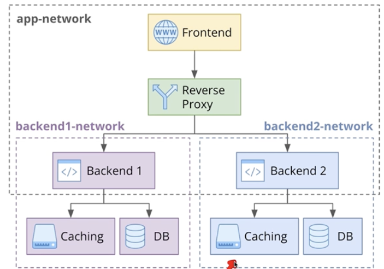

# Docker Compose

More robust multi-container management for development workflows


- Natural development can lead to many docker containers needing to be managed and handled simultaneously

Managing multi-container apps only using Docker can be challenging:
1. Manually starting and linking multiple containers is error-prone
2. Ensuring containers start in the correct order can be challenging
3. It's difficult to ensure consistency across environments leading to bus and integration issues
4. Managing networks  for inter-container communication and volumes for persistent storage across container restarts isn't as simple as it sounds
5. Managing config via env variables can be complex and require checking multiple places to get a consolidated view of configuration

## Docker Compose: more robust management for dev workflows

When to use Docker Compose?
1. Local Development
    - Create consistent dev environments easily
2. Testing and Staging Environments
    - Replicate production envs for accurate testing
3. CI/CD Pipelines
    - Automate environment setup during build and deployment
    ```
    docker-compose up -d
    ./tests
    docker-compse down
    ```
4. Single-host production deployments
    - Ideal for small-scale production setups
