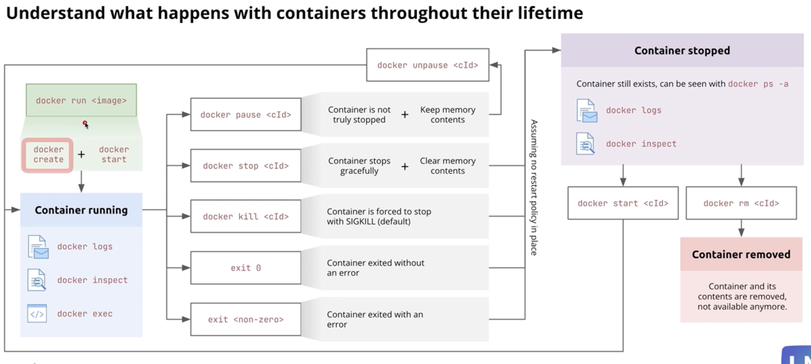

# Docker Container Lifecycle

`docker run <image>`
- combination of `docker create` and `docker start`

Once the container is running we have access to:
- docker logs
- docker inspect
- docker exec
 
 Actions while the container is running:
 - `docker pause <cId>`: container is not truly stopped + keeps memory contents
 - `docker stop <cId>`
    - Gracefully stops the container and clears memory contents
- `docker kill <cId>`
    - Contianer is forced to stop with SIGKILL(default)
- `exit 0`
    - Contianer is exited without an error when container wraps up it's functionality
- `exit <non-zero>`
    - Container exited with an error

Container Stopped Phase
- when `stop | kill | exit ` causes the container to stop
- During this phase the container still exists and can be seen with `docker ps -a`
    - `-a` needs to be present to see stopped containers
- able to see `docker logs`, `docker inspect` during this phase

`docker start <cId>`: to restart stopped containers
`docker unpasue <cId>` : to restart PAUSED contianers
`docker rm <cId>`: to remove the container and it's contents
