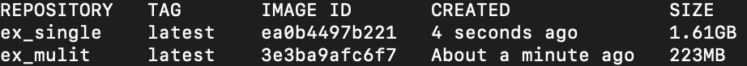

# MultiStage Dockerfiles

 For languages such as Java and Go, there is a build and run phase. Multistaging Dockerfiles are able to leverage smaller images for the run stages while using larger images for full build functionality.

 *Dockerfile Multistage for [express_app](../projects/express_basic/Dockerfile)*

 - Use a larger standard base image for building and installing dependencies and switch to the smaller distroless image for runtime
    - smaller images = faster container, less security vulnerabilities


Steps:
1. Start with a standard base image to download dependencies
2. Switch to a smaller base image
3. Copy downloaded dependencies from the larger image stage
 ```
FROM node:22-alpine AS build
WORKDIR /app
COPY package*.json
RUN npm ci

FROM gcr.io/distroless/nodejs22 
WORKDIR /app
COPY --from=build /app/node_modules node_modules
COPY src src
ENV PORT=3000
CMD [ "src/index.js"]

 ```

 `AS`: Allows to alias the base image as `build`
 - use the build stage to execute the `RUN npm ci` (the distroless doesn't have `npm ci` cmd)

 `COPY --from=build /app/node_modules node_modules`
 - In the distroless image, this `COPY` cmd tells Docker to look at the `build` image and copy all the node_modules found in the `build`'s `app` directory into the currrent distroless `app` directory

`CMD ["src/index.js"]`
- `"node"` is already set as the `ENTRYPOINT` in the distroless


- The size difference between the mulitstage build utilizing the standard node base image then switching to a distroless base image is huge compared to just the standard node base image
- This leads to faster containers and less security vulnerabilities at the cost os simplicity

## Typescript example (compile / build stages)

 ```
 FROM node:22-alpine AS build
WORKDIR /app
COPY package*.json .
RUN npm ci
COPY src src
COPY tsconfig.json tsconfig.json

RUN npm run build

FROM gcr.io/distroless/nodejs22 
WORKDIR /app
COPY --from=build /app/node_modules node_modules
COPY --from=build /app/dist dist
ENV PORT=3000
CMD [ "dist/index.js"]
```

`docker build -t <img_name>:<img_tag>`
`docker run -d -p 3000:3000 --name <container_name> <img_name>:<img_tag>`

- This will download dependencies, compile the typescript code, copy the compiled code and node_modules only and then erun the index.
- Cuts way down on size of the container as we aren't including the ts source code and only the compiled, runnable js.
