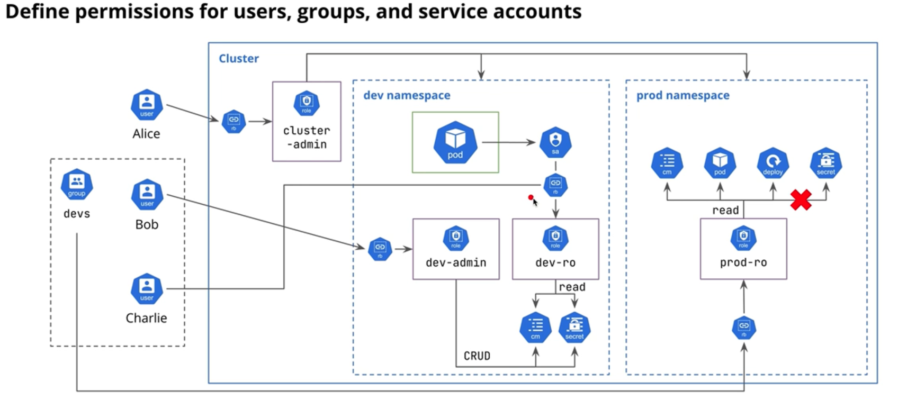

# Role-Based Access Control (RBAC)
Define permissions for users, groups, and service accounts

**RBAC** is a security model in K8 that defines and enforces permissions for users, service accounts, and groups to interact with cluster resources.

Permissions can target many different:
- Rescources: 
    - Pods, Deployments, secrets, configmaps, etc.
- Operations:
    - CRUD, as well as specific operations such as exec
- Allows for very fine-grained access control.
***RBAC is a must for any serious K8 cluster***

## 5 Components of RBAC
1. **Users, Groups, Service Accounts**
- Entitites against which RBAC policies will be enforced.
2. **Roles**
- Defines a set of permissions within a specific namespace.
- Specifies the actions (verbs: get, list, create) that can be performed on particular Kubernetes resources (pods, svc, secrets)
3. **RoleBindings**
- Assigns a `Role` to a user, gorup, or service account within a namespace.
4. **ClusterRoles**
- Similar to `Role`, but has an effect accross the entire cluster.
- Grant permissions to resources that are not namespaced, or across all namespaces.
5. **ClusterRoleBindings**
- Assigns a `ClusterRole` to a user, group, or service account.

