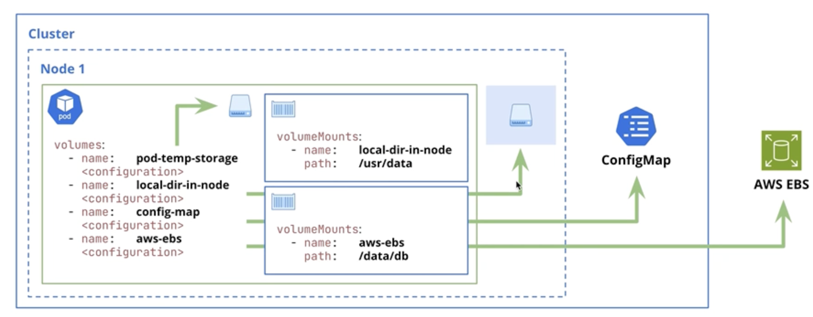

# Volumes

Persistent and share data in K8

Volumes are directories, possibly with some data in it, which are accessible to the containers in a pod.
- How that directory comes to be, the medium that backs it, and the contents of it are determined by the particular volume type used.

To use a volume, specify the volumes in the Pod's `spec.volumes` and declare where to mount those volumes into containers in `spec.containers[*].volumeMounts`.



## Types of Volumes

### `emptyDir`
Ephemeral storage within the Pod.
- Follows the lifecycle of the Pod: when the Pod is terminated, it's contents are also deleted.

Ephemeral and defined at the Pod level
- Volume is created when the Pod is assigned to a node.
- Volume is initially empty
- All containers in the Pod can read/write the same files in the `emptyDir` volume.
- Containers might mount the volume in different paths.

### `local`
Durable storage within a specific node.
- Requires setting node affinity to correctly schedule Pods on the correct nodes.
- Preffered over `hostPath`

`local` volumes are peristent and defined at the Node level.
- kube-scheduler knows how to assign Pods to Nodes based on the affinity contraints defined in the `PersistentVolume` configuration.
- Setting a `PersistentVolume nodeAffinity` is mandatory when using local volumes.
- Like other `PersistentVolumes`, it requires creating `PersistentVolumeClaims` so that Pods can use the storage.
- Only supports static provisioning.

`local` volumes follow the Node's lifecycle; `emptyDir` follows the Pod's lifecycle

### `Persistent Volume`
Durable storage backed by multiple technologies (cloud storage).
- Can be statically or dynamically provisioned.

### `ConfigMap`
Inject configuration data into Pods without having to hard-code the data into the Pod definition.

### `Secret`
Inject sensistive data into Pods without having to hard-code the data into the Pod definition.

```
spec:
    resources:
        volumeMounts:
            - name: <name_of_volume>
              mountPath: <path_of_where_volume_is_mounted>
    volumes:
        - name: <name_of_volume>
          emptyDir: | 
```

Volumes can be mounted to more than one container. The `mountPath` doesn't have to be the same between containers

When exec into a pod with more than one container, `-c <container_name>` is how to specify a target container within the pod.
Ex for [empty-dir-ex](./volume_ex/empty-dir-example.yaml)
- `kubectl exec -it empty-dir-demo -c empty-dir-writer -- sh`


## Persistent Volume Claims
Claim durable storage for usage in Pods. Can't use PV directly in Pods

A `PersistentVolumeClaim` is what actually reserves a PV (when using static povisioning) or creates and reserves a PV (when dynamic provisioning)
- Claims are bound to a single `PersistentVolume`, and a `PersistentVolume` can have at most one claim bound to it.
    - One to one volume to claim
    - Can set specific criteria in a claim,so that only PVs that match these criteria are considered for binds
    - Be mindful of the possibility for extra unused capacity (static provisioning)
    - Reclamation policies can be `Retain`, `Delete`, or `Recycle`(depreciated)
- Access Modes:
    - `ReadWriteOnce`: volume can be mounted as a read-write by a single node. Can be used by any number of Pods within the node.
    - `ReadOnlyMany`: volume can be mounted as read-only by many nodes.
    - `ReadWriteMany`: volume can be mounted as read-write by many nodes.
    - `ReadWriteOncePod`: volume can be mounted as read-write by a single Pod.