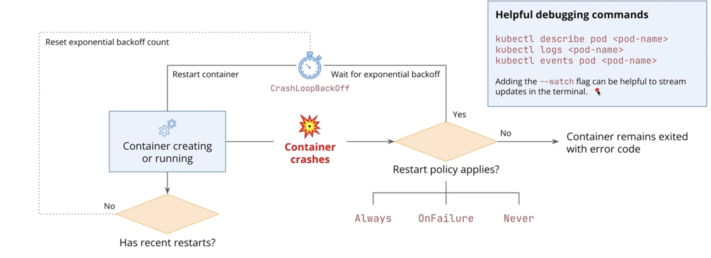

# Kubernetes Pods

## Pods are the smallest and simplest unit that you create to run containers

Pods represent a single instance of arunning process in your cluster:
- Encapsulate one or more containers
- Allow containers to share storage and network resources
- Provide multiple options to configure how containers are ran
    - ports, env variables, volumes, security, etc.

Pods provide a higher level abstraction than working directly with containers:
- Allows multiple containers to work together if necessary
- Containers running in the same Pod can communicate with each other via `localhost`
    - They can also read/write to the same volumes

Pods can communicate with each other by default in K8

We can set health probes in each container so that they're restarted or stop receiving traffic if considered unhealthy.

## Pod Lifecycle

1. Creation
- Pods are created via Kubernetes API 
    - ReplicaSets or kubectl

2. Pending
- One or more containers are not ready to run
    - Pod to be scheduled in Node (scheduler sees lack of resources in nodes or hasn't gotten to it yet)
    - Container images will be downloaded: `ContainerCreating`

3. Running:
- All containers have been created
- At least one container is still running or in the process of restarting

4a. Succeeded 
- All containers in the Pod have terminated successfully and will not be restarted

4b. Failed
- All containers in the Pod have terminated, at least one container has terminated in failure (non-zero exit)

4c. Unknown
- Pod's status couldn't be obtained 
    - Communication error with the Node running the pod
    - Other issues

### How Pods Handle Container Error

`CrashLoopBackOff` - exponential backoff on restarting the container on subsequent container failures.

If the container hasn't had any recent restarts, K8 will reset that container's exponential backoff count